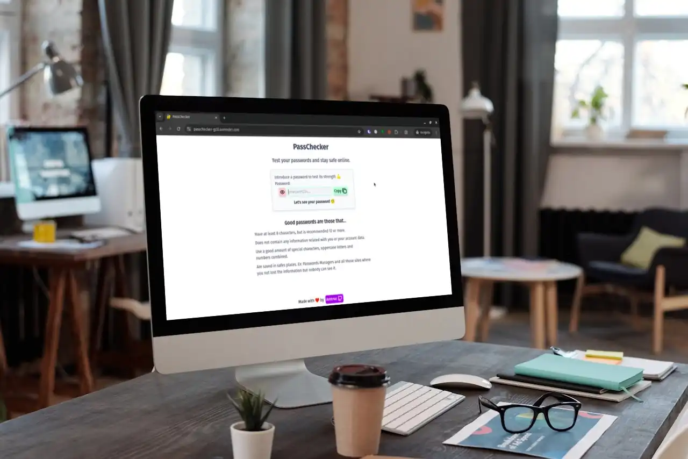

# PassChecker

An cybersecurity mini-tool to help you craft and review your passwords.

## Author

[Amtr4x](http://github.com/Amtr4x)

## Technologies employed

- Vue 3
- Typescript
- Tailwindcss 3
- Vite 6
- Vitest 2

## Credits

- [Icons from tabler.io](https://tabler.io/icons)
